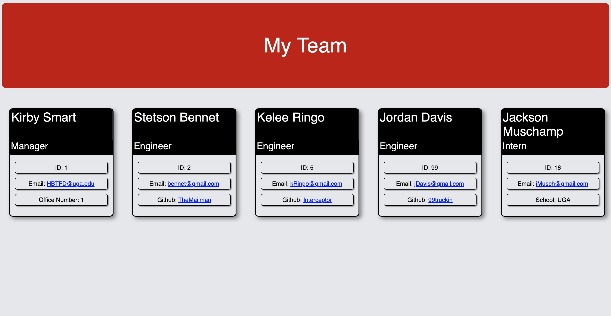

# Team Builder

## Description
 

This is a CLI app that will allow you to build a team consisting of a manager, and as many engineers and/or interns as you would like.  You can then input their information, and the app will create a static HTML page that displays the team.

Click below to see a video walkthrough.

---

## Table of Contents

[Installation](#Installation)

[Usage](#Usage)

[License](#License)

[Tests](#Tests)

[Questions](#Questions)

---

## Installation

To install this app, clone the repository and run npm i

---

## Usage

To use this app, run 'node index.js' or 'npm start'

---

## License

[ISC License](https://opensource.org/licenses/ISC)

---
## Tests

This project uses jest for testing.  Be sure to use the npm command as it uses node experimental modules. 

To test, run npm test.

---

## Questions?

For any questions, please visit my Github: [github.com/AaronMikelKey](https://github.com/AaronMikelKey)

or send me an email at [AaronMikelKey@gmail.com](mailto:AaronMikelKey@gmail.com)
